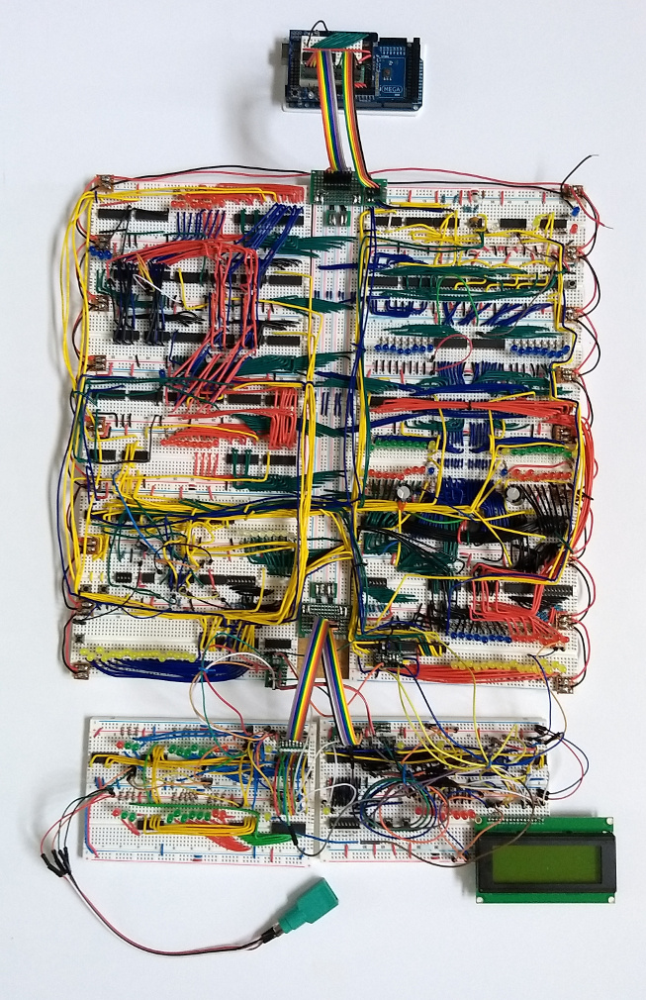

# 8-bit
Home of the 8-bit computer project

[(full size)](pics/main.jpg)

### Hardware
[Full schematics for the main system](schematics/main_combined_cleaned.jpg)

Coming soon: schematics for I/O expansion boards, bill of materials, photographs, detailed build instructions

### Documentation
[Architecture](docs/arch.md)

[Instruction set](docs/isa.md)

[Programming](docs/programming.md)

Coming soon: block diagram, more thorough documentation

### Software
[Assembler](software/assembler.py)

["Guess the Number" demo program](software/guess%20the%20number%20v4.asm)

[BASIC interpreter](software/basic.asm)

[Emulator](software/sim%20v5.py)

Coming soon: software documentation, more complete emulator, more demo programs
